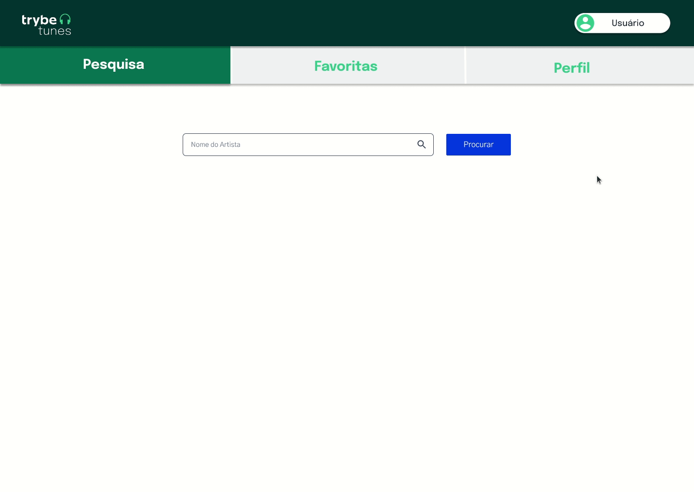

# Welcome to the Trybetunes project repository!

### README Translations:

-   [English](/README.en.md)
-   [Portuguese](/README.md)

* * *

## 👨‍💻 What was developed:

-   In this project I developed TrybeTunes, an application capable of playing songs from the most varied bands and artists, creating a list of favorite songs and editing the profile of the user logged in. This application is capable of:

    -   Login;
    -   Search for a band or artist;
    -   List available albums by that band or artist;
    -   View songs from a selected album;
    -   Play a preview of the songs on this album;
    -   Favorite and unfavorite songs;
    -   View the list of favorite songs;
    -   See the profile of the person logged in;
    -   Edit the profile of the person logged in;

:bulb:**See a sample below:**


## Skills used:

-   Make requests and consume data from a`API`;

-   Use the lifecycles of a React component;

-   use the function`setState`in order to guarantee that a certain code is only executed after the state is updated

-   use the component`BrowserRouter`correctly;

-   Create routes, mapping the URL path with the corresponding component, via`Route`;

-   use the`Switch`do`React Router`

-   Create navigation links in the application with the component`Link`;

# requirements

## 1. Create the necessary routes for the application

You must use the`BrowserRouter`to create your application's routes and each route should render a specific component. Create each component inside the folder`src/pages`, as indicated below:

<details><summary> Rota <code>/</code></summary>

-   to broken`/`should render a component called`Login`. This component must have a`div`with the attribute`data-testid="page-login"`that involves all of its content;
    </details>

<details><summary> Rota <code>/search</code></summary>

-   to broken`/search`should render a component called`Search`. Este componente deve ter uma `div`that involves all its content and have the attribute`data-testid="page-search"`;
    </details>

<details><summary> Rota <code>/album/:id</code></summary>

-   to broken`/album/:id`should render a component called`Album`. This component must have a`div`that involves all its content and have the attribute`data-testid="page-album"`;
    </details>

<details><summary> Rota <code>/favorites</code></summary>

-   to broken`/favorites`should render a component called`Favorites`. This component must have a`div`that involves all its content and have the attribute`data-testid="page-favorites"`;
    </details>
    <details><summary> Rota <code>/profile</code></summary>

-   to broken`/profile`should render a component called`Profile`. This component must have a`div`that involves all its content and have the attribute`data-testid="page-profile"`;
    </details>

<details><summary> Rota <code>/profile/edit</code></summary>

-   to broken`/profile/edit`should render a component called`ProfileEdit`. This component must have a`div`that involves all its content and have the attribute`data-testid="page-profile-edit"`;
    </details>

<details><summary> Para qualquer outra rota não mapeada</summary>

For any other unmapped route, a component called`NotFound`. This component must have a`div`that involves all its content and have the attribute`data-testid="page-not-found"`;

</details><br />

<details>
  <summary><strong>O que será verificado</strong></summary><br />
  
  - A rota `/` é uma rota existente e que renderiza um componente com o `data-testid` com valor `page-login`;

-   to broken`/search`is an existing route that renders a component with the`data-testid`with value`page-search`;

-   to broken`/album/:id`is an existing route that renders a component with the`data-testid`with value`page-album`;

-   to broken`/favorites`is an existing route that renders a component with the`data-testid`with value`page-favorites`;

-   to broken`/profile`is an existing route that renders a component with the`data-testid`with value`page-profile`;

-   to broken`/profile/edit`is an existing route that renders a component with the`data-testid`with value`page-profile-edit`;

-   There is a page for unmapped routes and it renders a component with the`data-testid`with value`page-not-found`;
    </details>

* * *

## 2. Create a form for identification

<details><summary>Dentro do componente <code>Login</code>, que é renderizado na rota <code>/</code>, crie um formulário para que a pessoa usuária se identifique com um nome:</summary>

-   You must create a field for the user to enter their name. This field must have the attribute`data-testid="login-name-input"`.

-   Create a button with the text`Entrar`. This button must have the attribute`data-testid="login-submit-button"`.

-   The button to enter must only be enabled if the name entered has 3 or more characters.

-   By clicking the button`Entrar`, use the function`createUser`and`userAPI`to save the entered name. The function`createUser`expects to receive an object with the person's information as an argument:

```javascript
createUser({ name: "Nome digitado" });
```

:bulb:_Obs:_You will see in the requirements further on that you can pass on other information to the`createUser`, but don't worry about that now. For now you can only pass one object with the property`name`.

-   While the user information is being saved, a message with the text`Carregando...`should appear on the screen.**:bulb: I mean:**You'll need this message many times in the future, so it's a good idea to create a component for it :wink:

-   After the information has been saved, make a redirect to the route`/search`.


</details><br />

<details>
  <summary><strong>O que será verificado</strong></summary><br />

-   When navigating to the route`/`, the specified input and button are present;

-   The button is only enabled if the name input has 3 or more characters;

-   By clicking on the enabled button, the function`createUser`and`userAPI`is called;

-   When clicking the button, the message`Carregando...`is displayed and after the API response, the redirection to the route takes place`/search`.
    </details>

* * *

## 3. Create a header component

<details><summary>Crie um componente chamado <code>Header</code>, dentro da pasta <code>src/components</code>:</summary>

-   Create this component with the tag`header`involving all its content and with the attribute`data-testid="header-component"`;

-   Render header component on routes pages`/search`,`/album/:id`,`/favorites`,`/profile`e`/profile/edit`;

-   Use the function`getUser`and`userAPI`to retrieve the name of the person logged in and display this information on the screen. You can use any HTML tag that makes sense as long as it has the attribute`data-testid="header-user-name"`.

-   While waiting for a response from the`getUser`, display only the message of`Carregando...`.
    </details><br />

<details>
  <summary><strong>O que será verificado</strong></summary><br />

-   the component`Header`is rendered on the page`/search`;

-   the component`Header`is rendered on the page`/album/:id`;

-   the component`Header`is rendered on the page`/favorites`;

-   the component`Header`is rendered on the page`/profile`;

-   the component`Header`is rendered on the page`/profile/edit`;

-   The function`getUser`is called when rendering the component;

-   the message of`Carregando...`is displayed when rendering the component and is removed after returning from the API;

-   The name of the user is present on the screen after the API returns.
    </details>

* * *

## 4. Create navigation links in the header

<details><summary> Crie o link que redireciona para a página de pesquisa:</summary>

-   The link that redirects to the search page must be inside the component`Header`and must have the attribute`data-testid="link-to-search"`.
    </details>

<details><summary> Crie o link que redireciona para a página de músicas favoritas:</summary> 
  
  * O link que redireciona para a página de músicas favoritas deve estar dentro do componente `Header` e possuir o atributo `data-testid="link-to-favorites"`.
</details>

<details><summary> Crie o link que redireciona para a página de exibição de perfil:</summary> 

-   The link that redirects to the profile view page must be inside the component`Header`and must have the attribute`data-testid="link-to-profile"`.
    </details><br />

<details>
  <summary><strong>O que será verificado</strong></summary><br />

-   Navigation links are displayed on the search page;
-   Navigation between the search page and the favorite music page occurs correctly;
-   Navigation between the search page and the profile view page occurs correctly;
-   Navigation links are displayed on the album page;
-   Navigation between the album page and the search page works correctly;
-   Navigation between the album page and the favorite songs page works correctly;
-   Navigation between the album page and the profile view page occurs correctly;
-   Navigation links are displayed on the favorite songs page;
-   Navigation between the favorite music page and the search page occurs correctly;
-   Navigation between the favorite music page and the profile view page occurs correctly;
-   Navigation links are displayed on the profile view page;
-   Navigation between the profile view page and the search page occurs correctly;
-   Navigation between the profile view page and the favorite music page occurs correctly;
-   Navigation links are displayed on the profile edit page;
-   Navigation between the profile edit page and the search page occurs correctly;
-   Navigation between the profile edit page and the favorite music page is correct;
-   Navigation between the profile edit page and the profile view page occurs correctly.
    </details>

* * *

## 5. Create the form to search for artists

This form must contain an input and a button so that it is possible to search the albums of a band or artist.

<details><summary> Crie o formulário dentro do componente <code>Search</code>, que é renderizado na rota <code>/search</code>:</summary>
    
  * Crie um campo para pessoa digitar o nome da banda ou artista a ser pesquisada. Esse campo deve ter o atributo `data-testid="search-artist-input"`.
  
  * Crie um botão com o texto `Pesquisar`. Esse botão deve ter o atributo `data-testid="search-artist-button"`.

-   The button should only be enabled if the artist's name has 2 or more characters.

    

    </details><br />

<details>
  <summary><strong>O que será verificado</strong></summary><br />

-   When navigating to the route`/search`, the input and the button are present on the screen;

-   The button is enabled only if the name input has 2 or more characters.
    </details>

* * *

## 6. Make the request to search for artists

With the structure of the search screen created, now it's time to make a request and receive the list of albums of the band or artist being searched.

-   <details><summary> Ao clicar no botão de <code>Pesquisar</code>, limpe o valor do input e faça uma requisição utilizando a função do arquivo <code>searchAlbumsAPIs.js</code>:</summary>

    -   :bulb: Remember that this function expects to receive a string with the name of the band or artist.

    -   While waiting for API response, hide input and search button and display message`Carregando...`on the body.

    -   After receiving the request response, display the text on the screen`Resultado de álbuns de: <artista>`, Where`<artista>`is the name that was typed in the input.
        </details>

-   <details><summary> Liste os álbuns retornados. A API irá retorna um <i>array</i> de objetos. Cada objeto terá a seguinte estrutura:</summary> 

        [
          {
            artistId: 12,
            artistName: "Artist Name",
            collectionId: 123,
            collectionName: "Collection Name",
            collectionPrice: 12.25,
            artworkUrl100: "https://url-to-image",
            releaseDate: "2012-03-02T08:00:00Z",
            trackCount: 8,
          }
        ]

    

    </details>

-   <details><summary> Se nenhum álbum for encontrado para o nome pesquisado, a API irá retornar um array vazio. Nesse caso, a mensagem `Nenhum álbum foi encontrado` deverá ser exibida:</summary>

    

    </details>

-   <details><summary> Ao listar os álbuns, crie um link em cada card para redirecionar para a página do álbum. Este link deve ter o atributo <code>data-testid={`link-to-album-${collectionId}`}</code>. Onde `collectionId` é o valor da propriedade de cada Álbum:</summary>

    -   This link should redirect to the route`/album/:id`, Where`:id`is the property value`collectionId`of each Album in the list received by the API.
        </details><br />

<details>
  <summary><strong>O que será verificado</strong></summary><br />

-   By clicking on`pesquisar`, the request is made using the`searchAlbumsAPI`;

-   When you click the button, the text`Resultado de álbuns de: <artista>`appears on the screen;

-   Upon receiving feedback from the API, the albums are listed on the screen;

-   If the API does not return any albums, the message`Nenhum álbum foi encontrado`is displayed;

-   There is a link for each album listed that redirects to the route`/album/:id`.
    </details>

* * *

## 7. Create the playlist of the selected album

Now that everything is ready, you will be able to view the playlist of the selected album.

<details><summary>Crie a lista dentro do componente <code>Album</code>, que é renderizado na rota <code>/album/:id</code>: </summary>

-   When entering the page, make a request using the function`getMusics`of the file`musicsAPI.js`. Remember that this function expects to receive a string with the album id.

-   Display the name of the band or artist on the screen. You can use any HTML tag that makes sense as long as it has the attribute`data-testid="artist-name"`.

-   Display the album name and band or artist name on the screen. You can use any HTML tag that makes sense as long as it has the attribute`data-testid="album-name"`.

-   List all songs in the album on the screen. To do this, create a component called`MusicCard`which should display the name of the song (property`trackName`in the object received by the API) and a player to play the music preview (property`previewUrl`on the object received by the API).

:bulb:**Tip:**Remember that the function return`getMusics`, when it finds the information, is an array where the first element is an object with album information and the rest of the elements are the songs in the album.

To play the preview, you must use the tag`audio`of the HTML itself. Its implementation is like this:

```html
<audio data-testid="audio-component" src="{previewUrl}" controls>
  <track kind="captions" />
  O seu navegador não suporta o elemento{" "} <code>audio</code>.
</audio>
```

**Important:**remember to put the attribute`data-testid="audio-component"`that tag`audio`of each song listed.


</details><br />

<details>
  <summary><strong>O que será verificado</strong></summary><br />
  
  - Se o serviço de `musicsAPI` está sendo chamado;
  
  - Se o nome da banda ou artista e o nome do álbum são exibidos;
  
  - Se todas músicas retornadas pela API são listadas.
</details>

* * *

## 8. Create the mechanism to add songs to favorite song list

You can now list songs from albums. At this stage you can mark which songs you like the most.

-   <details><summary> No componente <code>MusicCard</code>, crie um input do tipo <code>checkbox</code> para marcar as músicas favoritas:</summary> 

    -   This input must contain a`label`with the text`Favorita`and must have the attribute``data-testid={`checkbox-music-${trackId}`}``, Where`trackId`is the property`trackId`of the object received by the API.
        </details>

-   <details><summary> Para adicionar uma música a lista de favoritas, utilize a função <code>addSong</code> da <code>favoriteSongsAPI</code>. Você deve passar para essa função um objeto no mesmo formato que você recebe da API <code>getMusics</code>:</summary>

    -   While waiting for the function to return`addSong`, render the message from`Carregando...`.
        </details>

<details><summary><b> Ilustração:</b></summary>


</details><br />

<details>
  <summary><strong>O que será verificado</strong></summary><br />

-   There is a checkbox for each song in the list;

-   The function`addSong`is called when some checkbox is clicked;

-   The message`Carregando...`is displayed after clicking the checkbox and removed after the API returns.
    </details>

* * *

## 9. Make request to retrieve favorite songs by entering Album page

<details><summary> Ao entrar na página com a lista de músicas de um álbum, na rota <code>/album/:id</code>, as músicas que já foram favoritadas anteriormente devem estar com o checkbox marcado</summary>

-   When entering the page, use the function`getFavoriteSongs`and`favoriteSongsAPI`to retrieve the favorite song list.

-   While waiting for the API response, display the message`Carregando...`.

-   The list received by the function`getFavoriteSongs`must be saved in your application state.

-   After receiving the function return`getFavoriteSongs`, songs that have already been favorited must have the checkbox marked as`checked`.

    

    </details><br />

<details>
  <summary><strong>O que será verificado</strong></summary><br />

-   The requisition for`getFavoriteSongs`is made to retrieve favorite songs;

-   Upon entering the page, the number of checkboxes marked as`checked`corresponds to the number of songs that have already been favorited;
    </details>

* * *

## 10. Make request to retrieve favorite songs and update list after favorite song

<details><summary> Após adicionar uma música na lista de favoritas usando a função <code>addSong</code> (Requisito 8), faça uma requisição usando a função <code>getFavoriteSongs</code> para atualizar a lista de músicas favoritas:</summary>

-   When favoriteing a song, wait for the function to return`addSong`(which has already been implemented in requirement 8) and use the function`getFavoriteSongs`and`favoriteSongsAPI`to retrieve the favorite song list.

-   While waiting for the API response, display the message`Carregando...`.

-   Update the application state with the value received by the function return`getFavoriteSongs`.

-   After receiving the function return`getFavoriteSongs`, songs that have already been favorited must have the checkbox marked as`checked`.
    </details><br />

<details>
  <summary><strong>O que será verificado</strong></summary><br />

-   The requisition for`getFavoriteSongs`is done after favoriteing a song;

-   The number of checkboxes marked as`checked`increases when a checkbox is clicked.
    </details>

* * *

## 11. Create the mechanism to remove songs in favorite song list

After you list and favorite songs in an album, you should also be able to remove a song from your favorites list.

<details><summary> Ao clicar em uma música que já está marcada como favorita, ela deve ser removida da lista de músicas favoritas. Para isso você deve usar a função <code>removeSong</code> da <code>favoriteSongsAPI</code>. Essa API espera receber um objeto no mesmo formato que foi passado anteriormente para a função <code>addSong</code>: </summary>

-   While waiting for the function to return`removeSong`, render the message from`Carregando...`.<br />

    

    </details><br />

<details>
  <summary><strong>O que será verificado</strong></summary><br />

-   The function`removeSong`is called when any checkbox that is already checked is clicked;

-   The message`Carregando...`is displayed after clicking on the checkbox and removed after returning from the API;

-   The number of checkboxes marked as`checked`decreases when a ticked checkbox is clicked;
    </details>

* * *

# bonus requirements

## 12. Create favorite song list

<details><summary> Crie a lista dentro do componente <code>Favorites</code>, que é renderizado na rota <code>/favorites</code>.</summary>

-   When entering the page, use the function`getFavoriteSongs`and`favoriteSongsAPI`to retrieve the favorite song list.

-   While waiting for the API response, display the message`Carregando...`.

-   After receiving the function return`getFavoriteSongs`, use the component`MusicCard`to render the list of favorite songs.

-   On this page it should be possible to unfavorite the songs. For this, use the function`removeSong`and`favoriteSongsAPI`.

-   While waiting for the API response, display the message`Carregando...`.

-   After removing the song, refresh the list using the function`getFavoriteSongs`. Remember to display the message`Carregando...`while waiting for the API to return.

    

    </details><br />

<details>
  <summary><strong>O que será verificado</strong></summary><br />

-   The requisition for`getFavoriteSongs`is made to retrieve favorite songs;

-   The list of favorite songs is displayed;

-   The favorite song list is updated when you remove a song from the list.
    </details>

* * *

## 13. Create the profile view

<details><summary> Crie a exibição do perfil dentro do componente <code>Profile</code>, que é renderizado na rota <code>/profile</code></summary>

-   Use the function`getUser`and`userAPI`to retrieve the information of the person logged in.

-   While waiting for the API response, display the message`Carregando...`.

-   After receiving feedback from`getUser`, display the name, email, description and picture of the person logged in.

-   To display the image, use the HTML tag`img`with the attribute`data-testid="profile-image"`;

-   Create a link that redirects to the profile edit page (route`/profile/edit`). This link must have the text`Editar perfil`.

    

    </details><br />

<details>
  <summary><strong>O que será verificado</strong></summary><br />

-   A API`getUser`is used to retrieve the information of the person logged in;

-   The information of the person logged in is displayed on the screen;

-   A link to the profile edit route has been created with the text`Editar perfil`;

-   By clicking on the link`Editar perfil`, navigation happens correctly.
    </details>

* * *

## 14. Create the profile edit form

Create profile edit form inside component<code>ProfileEdit</code>, which is rendered in the route<code>/profile/edit</code>.

-   <details><summary> Utilize a função <code>getUser</code> da <code>userAPI</code> para recuperar as informações da pessoa logada: </summary>

    -   While waiting for the API response, display the message "Loading...".
        </details>

-   <details><summary> Após receber as informações da pessoa logada, renderize um formulário já preenchido com os seguintes campos:</summary>

    -   A field to change the username of the person. This field must have the attribute`data-testid="edit-input-name"`;

    -   A field to change the user's email address. This field must have the attribute`data-testid="edit-input-email"`;

    -   A field to change the description of the user person. This field must have the attribute`data-testid="edit-input-description"`;

    -   A field to change the user's photo. This field must have the attribute`data-testid="edit-input-image"`;

    -   A button to save changed information. This button must have the attribute`data-testid="edit-button-save"`.
        </details>

-   <details><summary>Para poder habilitar o botão de enviar, todos os campos precisam estar preenchidos (não podem estar vazios): </summary>

    -   The email field, in addition to not being empty, also needs to verify that the email has a valid format, that is, it must follow the standard`test@test.com`.

    -   The save information button should only be enabled when all fields are valid, that is, all fields are filled in and the email field has a value in valid format.

    -   When the button is enabled, use the function<code>updateUser</code>and<code>userAPI</code>to update the user's information. This API expects to receive an object in the following format:

              {
                name: '',
                email: '',
                image: '',
                description: '',
              }

    -   While waiting for the API response, display the message`Carregando...`.
        </details>

-   At the end of the editing process, redirect the logged in person to the profile view page (route`/profile`).
    </details>

<details><summary><b> Ilustração:</b></summary>


</details><br />

<details>
  <summary><strong>O que será verificado</strong></summary><br />

-   A request is made for`getUser`to retrieve the information of the person logged in;

-   The form is rendered already filled with the information of the person logged in;

-   You can change field values;

-   The button`salvar`is enabled only if all fields are valid;

-   Information is sent using the API`updateUser`;

-   After saving the information the person is redirected to the profile view page.
    </details>

* * *
